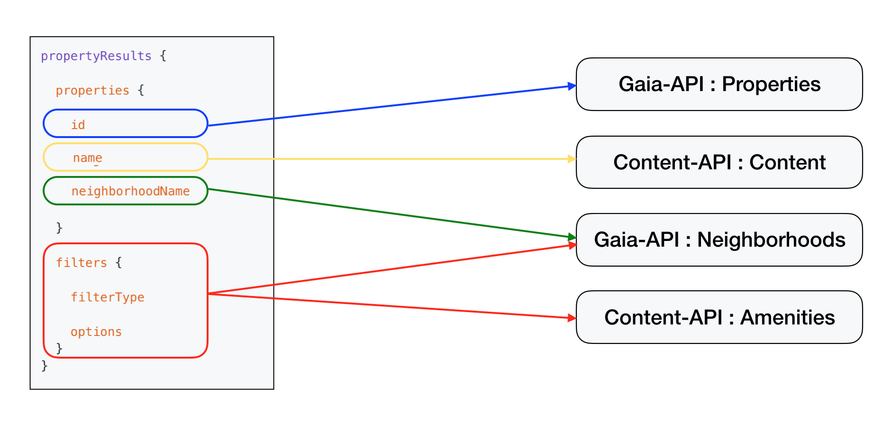

## About the repo
* GraphQL kotlin spring boot server for demoing Kotlin co-routines

## Demo Setup
* Requires java 11.0.3 or higher
* `mvn clean install`
* `git fetch --tags` to pull down all the tags
* `mvn spring-boot:run` will start up server and playground can be accessed at http://localhost:8080/playground
*  GraphQL query:
```GraphQL
query {
  propertyResults {
    properties {
      id
      neighborhoodName
      name
    }
    filters {
      filterType
      options
    }
  }
}
```

## Session details

### Downstream calls



### Workshop
During the session we will demo how to convert `PropertyResults` downstream calls to lazy co-routines
* `step-0` Non lazy version of downstream services (`git checkout step-0`)
* `step-1` Duplicate downstream calls (`git checkout step-1`)
* `step-2` Converting `PropertyResults` to lazy (`git checkout step-2`)

### Hands-on coding assignment
* Steps needed to convert `PropertyResults.properties` to lazy
    * Pull down latest from `master`. This will set us up till `step-2`
    * Convert `Property` data class fields to function equivalent
    * Convert `propertyContentResponse` in `PropertyResultsService` to a lazy Coroutine
    * Pass in `Deferred` `propertyContentResponse` and a `Deferred` `gaiaNeighborhoodResponse` to `PropertiesAdapter.adapt` and `Property`
    * `await` on deferred responses at the appropriate place in `Property` class